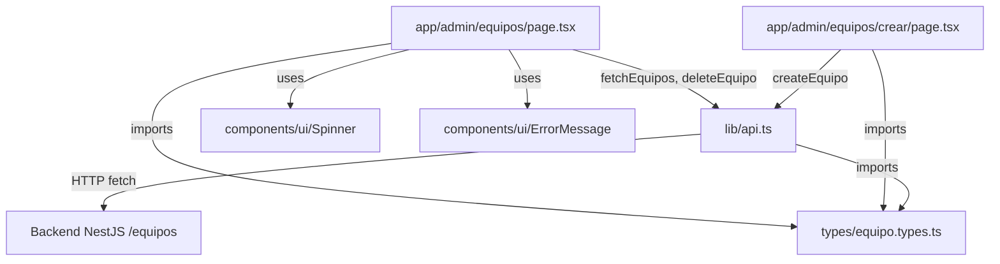

# Design Document: admin-equipos

## Overview

Esta feature integra la gestión de equipos en el panel de administración del frontend Next.js, conectándose con los endpoints REST del backend NestJS. Se replica el patrón existente de partidos (`types/partido.types.ts`, `lib/api.ts`, `app/admin/page.tsx`) para mantener consistencia arquitectónica.

Las rutas nuevas son:
- `GET/POST /equipos` — listado y creación
- `GET/PATCH/DELETE /equipos/:id` — operaciones individuales

El frontend expone:
- `/admin/equipos` — listado con filtro por liga y eliminación
- `/admin/equipos/crear` — formulario de creación

## Architecture



El flujo de datos sigue el mismo patrón que partidos:
1. El componente cliente llama a la función de `lib/api.ts`
2. `lib/api.ts` hace `fetch` al backend con `cache: 'no-store'`
3. Si la respuesta no es OK, lanza un `Error` con mensaje en español
4. El componente maneja loading/error/data con `useState` + `useEffect`

## Components and Interfaces

### `types/equipo.types.ts`

```typescript
export type Liga = "colombiana" | "española" | "inglesa";

export interface Equipo {
  _id: string;
  nombre: string;
  escudo: string;        // URL de imagen
  fechaCreacion: string; // ISO date string
  liga: Liga;
}

export interface CreateEquipoDto {
  nombre: string;
  escudo: string;
  fechaCreacion: string;
  liga: Liga;
}

export interface UpdateEquipoDto {
  nombre?: string;
  escudo?: string;
  fechaCreacion?: string;
  liga?: Liga;
}
```

### `lib/api.ts` — nuevas funciones

| Función | Método | URL | Notas |
|---|---|---|---|
| `fetchEquipos(liga?)` | GET | `/equipos[?liga=X]` | `cache: 'no-store'` |
| `fetchEquipoById(id)` | GET | `/equipos/:id` | — |
| `createEquipo(data)` | POST | `/equipos` | JSON body |
| `updateEquipo(id, data)` | PATCH | `/equipos/:id` | JSON body |
| `deleteEquipo(id)` | DELETE | `/equipos/:id` | — |

Todas lanzan `Error` con mensaje en español si `!response.ok`.

### `app/admin/equipos/page.tsx`

Client component (`'use client'`) con:
- `useState<Equipo[]>` para la lista
- `useState<Liga | undefined>` para el filtro activo
- `useState<boolean>` para loading
- `useState<string | null>` para error
- `useEffect` que llama `loadEquipos()` cuando cambia el filtro
- `handleDelete(id)` con `confirm()` antes de llamar `deleteEquipo`
- Tabla con columnas: nombre, escudo (img), liga, fechaCreacion, acciones
- Select de filtro con opciones: "Todas", "colombiana", "española", "inglesa"
- Link a `/admin/equipos/crear`

### `app/admin/equipos/crear/page.tsx`

Client component (`'use client'`) con:
- `useState<boolean>` para loading
- `useState<string | null>` para error
- `handleSubmit` que lee `FormData`, convierte `fechaCreacion` a ISO, llama `createEquipo`, redirige a `/admin/equipos`
- Campos: nombre (text), escudo (url), fechaCreacion (date), liga (select)
- Todos los campos con `required`
- Botón deshabilitado durante submit con label "Creando..."

## Data Models

### Equipo (entidad backend)

```
_id          : string   — MongoDB ObjectId como string
nombre       : string   — Nombre del equipo (ej. "Real Madrid")
escudo       : string   — URL absoluta de la imagen del escudo
fechaCreacion: string   — ISO 8601 date string (ej. "2024-01-15T00:00:00.000Z")
liga         : Liga     — "colombiana" | "española" | "inglesa"
```

### Flujo de datos en creación

```
FormData (date input "2024-01-15")
  → new Date("2024-01-15").toISOString()
  → "2024-01-15T00:00:00.000Z"
  → CreateEquipoDto { nombre, escudo, fechaCreacion, liga }
  → POST /equipos
  → Equipo { _id, nombre, escudo, fechaCreacion, liga }
```

### Flujo de filtrado

```
Liga seleccionada (o undefined para "Todas")
  → fetchEquipos(liga?)
  → GET /equipos?liga=colombiana  (o GET /equipos sin param)
  → Equipo[]
  → setState → re-render tabla
```

## Correctness Properties

*A property is a characteristic or behavior that should hold true across all valid executions of a system — essentially, a formal statement about what the system should do. Properties serve as the bridge between human-readable specifications and machine-verifiable correctness guarantees.*

### Property 1: Las funciones API construyen URLs y métodos HTTP correctos

*For any* id de equipo válido y datos de equipo válidos, cada función de la API debe construir la URL correcta y usar el método HTTP correcto: `fetchEquipos` → `GET /equipos`, `fetchEquipoById(id)` → `GET /equipos/:id`, `createEquipo` → `POST /equipos`, `updateEquipo(id)` → `PATCH /equipos/:id`, `deleteEquipo(id)` → `DELETE /equipos/:id`. Cuando se proporciona `liga` a `fetchEquipos`, la URL debe incluir `?liga={liga}`.

**Validates: Requirements 2.1, 2.2, 2.3, 2.4, 2.5**

### Property 2: Errores HTTP lanzan Error con mensaje en español

*For any* función de la API y cualquier código de estado HTTP no-OK (400–599), la función debe lanzar una instancia de `Error` con un mensaje descriptivo en español.

**Validates: Requirements 2.6**

### Property 3: La tabla renderiza todos los datos de los equipos

*For any* lista de equipos no vacía, la página de listado debe renderizar una fila por equipo que contenga el nombre, una imagen del escudo, la liga y la fecha de creación formateada.

**Validates: Requirements 3.1**

### Property 4: El filtro por liga re-fetcha con el valor correcto

*For any* valor de liga seleccionado en el filtro, `fetchEquipos` debe ser llamado con ese valor de liga como argumento. Cuando se selecciona "Todas", debe llamarse sin argumento.

**Validates: Requirements 3.5**

### Property 5: El formulario de creación transforma la fecha a ISO string

*For any* valor de fecha válido ingresado en el campo `fechaCreacion`, el valor enviado a `createEquipo` debe ser un ISO string válido (resultado de `new Date(value).toISOString()`).

**Validates: Requirements 4.7**

### Property 6: Envío exitoso del formulario redirige a /admin/equipos

*For any* conjunto de datos de equipo válidos enviados en el formulario, si `createEquipo` resuelve exitosamente, el router debe navegar a `/admin/equipos`.

**Validates: Requirements 4.3**

### Property 7: Errores de creación se muestran en el formulario

*For any* error lanzado por `createEquipo`, el mensaje de error debe ser visible en la página y el usuario debe permanecer en el formulario (no redirigir).

**Validates: Requirements 4.5**

## Error Handling

| Escenario | Comportamiento |
|---|---|
| `fetchEquipos` falla | `setError(message)` → renderiza `<ErrorMessage>` |
| `deleteEquipo` falla | `alert(message)` — consistente con patrón de partidos |
| `createEquipo` falla | `setError(message)` → muestra error inline, no redirige |
| Status no-OK del backend | `throw new Error('Mensaje en español')` en `lib/api.ts` |
| Lista vacía | Mensaje "No hay equipos registrados" en lugar de tabla vacía |

Los errores de red (fetch rechazado) son capturados por el bloque `catch` del componente y tratados igual que errores HTTP.

## Testing Strategy

### Unit Tests (ejemplos específicos y casos borde)

Enfocados en comportamientos concretos que no requieren generación de datos:

- Verificar que `fetchEquipos()` sin argumento no incluye `?liga=` en la URL
- Verificar que el spinner se muestra durante la carga
- Verificar que `<ErrorMessage>` se renderiza cuando el fetch falla
- Verificar que el filtro tiene exactamente 4 opciones (Todas + 3 ligas)
- Verificar que `confirm()` es llamado antes de `deleteEquipo`
- Verificar que tras eliminar exitosamente se recarga la lista
- Verificar que la lista vacía muestra "No hay equipos registrados"
- Verificar que el formulario tiene los 4 campos con `required`
- Verificar que el botón muestra "Creando..." y está deshabilitado durante submit
- Verificar que existe el link de cancelar a `/admin/equipos`

### Property-Based Tests (propiedades universales)

Librería recomendada: **fast-check** (compatible con Jest/Vitest, amplio soporte TypeScript).

Configuración mínima: **100 iteraciones** por propiedad.

Cada test debe incluir un comentario con el tag:
`// Feature: admin-equipos, Property {N}: {texto de la propiedad}`

**Property 1 — URLs y métodos HTTP correctos**
```
// Feature: admin-equipos, Property 1: Las funciones API construyen URLs y métodos HTTP correctos
fc.assert(fc.property(
  fc.string(), fc.record({...}), fc.constantFrom('colombiana','española','inglesa'),
  (id, data, liga) => {
    // mock fetch, call each API function, verify URL and method
  }
), { numRuns: 100 })
```

**Property 2 — Errores HTTP lanzan Error**
```
// Feature: admin-equipos, Property 2: Errores HTTP lanzan Error con mensaje en español
fc.assert(fc.property(
  fc.integer({ min: 400, max: 599 }), fc.string(),
  async (statusCode, id) => {
    // mock fetch returning statusCode, verify all API functions throw Error
  }
), { numRuns: 100 })
```

**Property 3 — Tabla renderiza todos los datos**
```
// Feature: admin-equipos, Property 3: La tabla renderiza todos los datos de los equipos
fc.assert(fc.property(
  fc.array(equipoArbitrary, { minLength: 1 }),
  (equipos) => {
    // render page with equipos, verify each row contains nombre, escudo img, liga, fecha
  }
), { numRuns: 100 })
```

**Property 4 — Filtro re-fetcha con liga correcta**
```
// Feature: admin-equipos, Property 4: El filtro por liga re-fetcha con el valor correcto
fc.assert(fc.property(
  fc.constantFrom('colombiana', 'española', 'inglesa', undefined),
  (liga) => {
    // simulate filter selection, verify fetchEquipos called with correct arg
  }
), { numRuns: 100 })
```

**Property 5 — Fecha convertida a ISO string**
```
// Feature: admin-equipos, Property 5: El formulario convierte la fecha a ISO string
fc.assert(fc.property(
  fc.date(),
  (date) => {
    const input = date.toISOString().split('T')[0]; // simula input type="date"
    const result = new Date(input).toISOString();
    expect(result).toMatch(/^\d{4}-\d{2}-\d{2}T\d{2}:\d{2}:\d{2}\.\d{3}Z$/);
  }
), { numRuns: 100 })
```

**Property 6 — Envío exitoso redirige**
```
// Feature: admin-equipos, Property 6: Envío exitoso del formulario redirige a /admin/equipos
fc.assert(fc.property(
  createEquipoDtoArbitrary,
  async (data) => {
    // mock createEquipo resolving, submit form, verify router.push('/admin/equipos')
  }
), { numRuns: 100 })
```

**Property 7 — Errores de creación se muestran**
```
// Feature: admin-equipos, Property 7: Errores de creación se muestran en el formulario
fc.assert(fc.property(
  fc.string({ minLength: 1 }),
  async (errorMessage) => {
    // mock createEquipo throwing Error(errorMessage), submit form, verify error visible
  }
), { numRuns: 100 })
```
