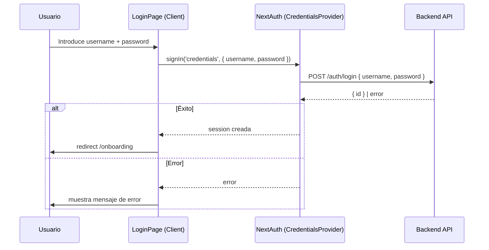
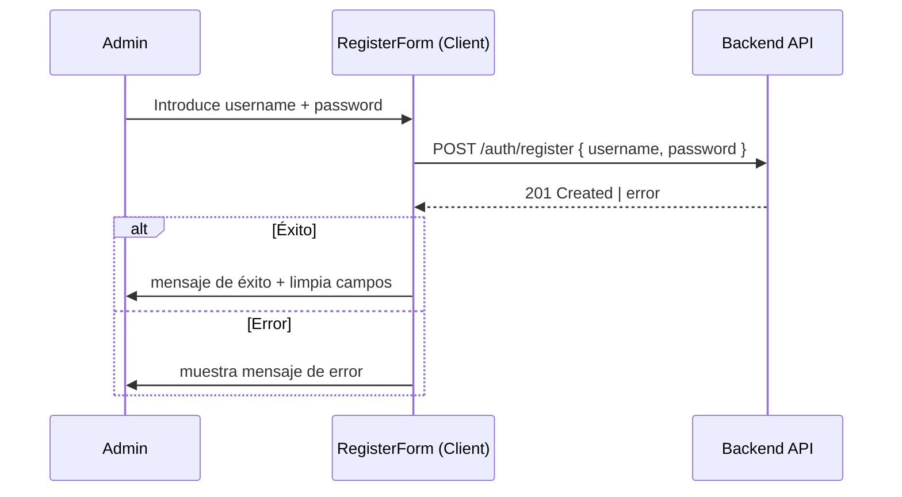

# Design Document: auth-credentials

## Overview

Esta feature reemplaza el sistema de autenticación OAuth (Google + GitHub) por autenticación con usuario y contraseña usando un backend propio. Se actualiza `auth.ts` para usar `CredentialsProvider` de NextAuth v5, se reemplaza la página de login con un formulario cliente, y se añade un formulario de registro en el área de admin.

El flujo es simple: el usuario introduce credenciales → NextAuth llama al backend → el backend valida y devuelve `{ id }` → NextAuth crea la sesión. El middleware existente no cambia.

## Architecture





## Components and Interfaces

### auth.ts (actualizado)

Reemplaza Google/GitHub por `CredentialsProvider`. Añade callbacks `jwt` y `session` para propagar el `id` del usuario.

```typescript
// Interfaz del authorize
authorize(credentials: { username: string; password: string }): Promise<User | null>

// User object retornado
interface AuthUser {
  id: string;
}
```

### LoginPage — `app/login/page.tsx` (reemplazado)

Componente cliente (`'use client'`) con formulario de username/password. Usa `signIn('credentials', ...)` de NextAuth. Maneja estados de loading y error localmente con `useState`.

```typescript
// Estado del componente
{ username: string, password: string, error: string | null, isPending: boolean }

// Flujo
handleSubmit → signIn('credentials', { username, password, redirectTo: '/onboarding' })
             → si error: setError(mensaje)
```

### RegisterForm — `app/admin/register/page.tsx` (nuevo)

Componente cliente en el área de admin. Llama directamente a `POST /auth/register`. Maneja estados de loading, error y éxito.

```typescript
// Estado del componente
{ username: string, password: string, error: string | null, success: boolean, isPending: boolean }

// Flujo
handleSubmit → fetch(`${NEXT_PUBLIC_API_URL}/auth/register`, { method: 'POST', body: { username, password } })
             → si ok: setSuccess(true) + limpiar campos
             → si error: setError(mensaje)
```

## Data Models

### Session (NextAuth)

NextAuth v5 requiere extender los tipos para incluir campos custom. Se añade `id` al token JWT y a la sesión.

```typescript
// Extensión de tipos (en auth.ts o types/next-auth.d.ts)
declare module 'next-auth' {
  interface Session {
    user: {
      id: string;
    } & DefaultSession['user'];
  }
}

// JWT callback: token.id = user.id (en authorize)
// Session callback: session.user.id = token.id as string
```

### Credentials payload

```typescript
interface LoginPayload {
  username: string;
  password: string;
}

interface LoginResponse {
  id: string;
}

interface RegisterPayload {
  username: string;
  password: string;
}
```

## Correctness Properties

*A property is a characteristic or behavior that should hold true across all valid executions of a system — essentially, a formal statement about what the system should do. Properties serve as the bridge between human-readable specifications and machine-verifiable correctness guarantees.*

### Property 1: authorize retorna usuario con id cuando el backend responde con éxito

*For any* par `(username, password)` y cualquier `id` devuelto por el backend, la función `authorize` del `CredentialsProvider` debe retornar un objeto de usuario cuyo campo `id` sea igual al `id` recibido del backend.

**Validates: Requirements 1.3, 2.2, 2.3**

---

### Property 2: authorize retorna null cuando el backend falla

*For any* par `(username, password)`, si el backend responde con un error HTTP (4xx, 5xx) o lanza una excepción de red, la función `authorize` debe retornar `null`.

**Validates: Requirements 2.4**

---

### Property 3: La sesión incluye el id del usuario

*For any* token JWT que contenga un campo `id`, el callback `session` de NextAuth debe producir un objeto de sesión cuyo `session.user.id` sea igual al `token.id`.

**Validates: Requirements 2.5**

---

### Property 4: registerUser llama al endpoint con los credentials correctos

*For any* par `(username, password)` enviado desde el `RegisterForm`, la petición HTTP resultante debe ser un `POST` a `${NEXT_PUBLIC_API_URL}/auth/register` con un body JSON que contenga exactamente `{ username, password }`.

**Validates: Requirements 3.3**

---

## Error Handling

| Escenario | Comportamiento |
|---|---|
| Backend devuelve 401/403 en login | `authorize` retorna `null` → NextAuth propaga error → LoginForm muestra mensaje |
| Backend no disponible (network error) | `authorize` captura excepción, retorna `null` → mismo flujo |
| Backend devuelve error en registro | `RegisterForm` captura el error, muestra mensaje, no limpia campos |
| Formulario enviado con campos vacíos | Validación HTML5 (`required`) previene el submit |
| Usuario ya autenticado visita `/login` | `auth()` detecta sesión activa → `redirect('/onboarding')` |

Los errores de NextAuth se propagan como `CallbackRouteError`. En el cliente, se detecta el error en el retorno de `signIn` y se muestra un mensaje genérico o el mensaje del backend si está disponible.

## Testing Strategy

### Unit Tests (ejemplos concretos)

Cubren comportamientos específicos y casos de borde:

- `LoginPage` renderiza campos de username y password (Req 1.1)
- `LoginPage` no renderiza botones de Google/GitHub (Req 4.2)
- `LoginPage` muestra spinner y deshabilita botón durante submit (Req 1.5)
- `LoginPage` muestra mensaje de error cuando `signIn` falla (Req 1.4)
- `LoginPage` redirige si hay sesión activa (Req 1.6)
- `RegisterForm` renderiza campos de username y password (Req 3.2)
- `RegisterForm` muestra mensaje de éxito y limpia campos tras registro exitoso (Req 3.4)
- `RegisterForm` muestra error sin limpiar campos cuando el backend falla (Req 3.5)
- `RegisterForm` deshabilita botón durante submit (Req 3.6)

### Property-Based Tests (propiedades universales)

Librería: **fast-check** (ya incluida en `devDependencies`).

Cada test debe ejecutarse con mínimo 100 iteraciones (configuración por defecto de fast-check).

```typescript
// Tag format: Feature: auth-credentials, Property {N}: {descripción}

// Property 1: authorize retorna usuario con id cuando el backend responde con éxito
// Feature: auth-credentials, Property 1: authorize returns user with id on success
fc.assert(fc.asyncProperty(
  fc.string({ minLength: 1 }), // username
  fc.string({ minLength: 1 }), // password
  fc.string({ minLength: 1 }), // id devuelto por backend
  async (username, password, id) => {
    mockFetch({ ok: true, json: async () => ({ id }) });
    const result = await authorize({ username, password });
    return result !== null && result.id === id;
  }
));

// Property 2: authorize retorna null cuando el backend falla
// Feature: auth-credentials, Property 2: authorize returns null on backend failure
fc.assert(fc.asyncProperty(
  fc.string({ minLength: 1 }),
  fc.string({ minLength: 1 }),
  fc.integer({ min: 400, max: 599 }), // status de error
  async (username, password, status) => {
    mockFetch({ ok: false, status });
    const result = await authorize({ username, password });
    return result === null;
  }
));

// Property 3: La sesión incluye el id del usuario
// Feature: auth-credentials, Property 3: session includes user id from token
fc.assert(fc.property(
  fc.string({ minLength: 1 }), // id
  (id) => {
    const token = { id };
    const session = sessionCallback({ session: { user: {} }, token });
    return session.user.id === id;
  }
));

// Property 4: registerUser llama al endpoint con los credentials correctos
// Feature: auth-credentials, Property 4: register sends correct payload
fc.assert(fc.asyncProperty(
  fc.string({ minLength: 1 }),
  fc.string({ minLength: 1 }),
  async (username, password) => {
    const captured = mockFetch({ ok: true, status: 201 });
    await registerUser(username, password);
    const body = JSON.parse(captured.body);
    return body.username === username && body.password === password;
  }
));
```

Cada propiedad debe implementarse en un único test de propiedad. Los unit tests y property tests son complementarios: los unit tests verifican ejemplos concretos y casos de borde, los property tests verifican la corrección general sobre el espacio de inputs.
