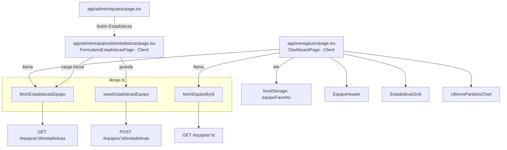

# Documento de Diseño: Dashboard Equipo Favorito

## Visión General

El feature reemplaza la página vacía `/navegacion` con un dashboard visual que muestra las estadísticas del equipo favorito del usuario autenticado. El ID del equipo se obtiene de `localStorage` (clave `equipoFavorito`), establecido durante el onboarding. Adicionalmente, se agrega un módulo de administración en `/admin/equipos/:id/estadisticas` que permite crear o actualizar estadísticas de cualquier equipo.

### Objetivos

- Mostrar nombre, escudo, liga y estadísticas del equipo favorito de forma visual con Recharts.
- Proveer funciones de API centralizadas (`fetchEstadisticasEquipo`, `saveEstadisticasEquipo`) en `lib/api.ts`.
- Agregar tipos `EstadisticasEquipo` y `ResultadoPartido` en `types/equipo.types.ts`.
- Permitir al administrador gestionar estadísticas desde `/admin/equipos/:id/estadisticas`.

### Restricciones Técnicas

- Next.js App Router con Tailwind CSS, tema oscuro slate/emerald.
- `app/navegacion/page.tsx` debe ser un Client Component (`'use client'`) por el uso de `localStorage`.
- Recharts requiere `'use client'` — todos los componentes con gráficos son Client Components.
- No hay SSR para el dashboard; la carga de datos ocurre en el cliente.

---

## Arquitectura



### Flujo del Dashboard

1. El componente lee `localStorage.getItem('equipoFavorito')`.
2. Si no existe → muestra pantalla de onboarding pendiente.
3. Si existe → dispara en paralelo `fetchEquipoById(id)` y `fetchEstadisticasEquipo(id)`.
4. Mientras cargan → muestra `Spinner`.
5. Al resolver → renderiza `EquipoHeader` + `EstadisticasGrid` + `UltimosPartidosChart`.
6. Si alguna llamada falla → muestra `ErrorMessage` con opción de reintentar.

### Flujo del Formulario Admin

1. La página recibe `params.id` de la ruta dinámica.
2. Intenta cargar estadísticas existentes con `fetchEstadisticasEquipo(id)`.
3. Si hay datos → pre-rellena el formulario; si hay error → muestra formulario vacío.
4. Al enviar → valida localmente → llama `saveEstadisticasEquipo(id, data)`.
5. Si éxito → mensaje de confirmación + redirect a `/admin/equipos`.
6. Si error → muestra mensaje sin limpiar el formulario.

---

## Componentes e Interfaces

### Nuevos Archivos

| Archivo | Tipo | Descripción |
|---|---|---|
| `app/navegacion/page.tsx` | Client Component | Dashboard principal (reemplaza el actual vacío) |
| `app/admin/equipos/[id]/estadisticas/page.tsx` | Client Component | Formulario de estadísticas para admin |
| `components/dashboard/EquipoHeader.tsx` | Client Component | Muestra nombre, escudo y liga del equipo |
| `components/dashboard/EstadisticasGrid.tsx` | Client Component | Grid de 4 métricas numéricas con Recharts |
| `components/dashboard/UltimosPartidosChart.tsx` | Client Component | Secuencia visual de últimos partidos |

### Archivos Modificados

| Archivo | Cambio |
|---|---|
| `lib/api.ts` | Agregar `fetchEstadisticasEquipo` y `saveEstadisticasEquipo` |
| `types/equipo.types.ts` | Agregar `ResultadoPartido` y `EstadisticasEquipo` |
| `app/admin/equipos/page.tsx` | Agregar botón "Estadísticas" por fila |

### Interfaces de Componentes

```typescript
// EquipoHeader
interface EquipoHeaderProps {
  equipo: Equipo;
}

// EstadisticasGrid
interface EstadisticasGridProps {
  estadisticas: EstadisticasEquipo;
}

// UltimosPartidosChart
interface UltimosPartidosChartProps {
  resultados: ResultadoPartido[];
}
```

### Diseño Visual de Componentes

**EquipoHeader**: Escudo centrado (80×80px), nombre en texto grande emerald, badge de liga.

**EstadisticasGrid**: 4 tarjetas en grid 2×2 (md: 4 columnas). Cada tarjeta muestra el valor numérico prominente y la etiqueta. Usa `RadialBarChart` de Recharts para `porcentajeVictorias` y `BarChart` simple para los promedios.

**UltimosPartidosChart**: Fila de badges coloreados — verde (`bg-emerald-500`) para `"G"`, rojo (`bg-red-500`) para `"P"`, amarillo (`bg-yellow-500`) para `"E"`. Si el array está vacío, muestra "Sin partidos recientes".

---

## Modelos de Datos

### Nuevos Tipos en `types/equipo.types.ts`

```typescript
export type ResultadoPartido = "G" | "P" | "E";

export interface EstadisticasEquipo {
  ultimosPartidos: ResultadoPartido[];
  porcentajeVictorias: number;   // 0–100
  promedioPases: number;          // entero positivo
  promedioTirosAlArco: number;    // entero positivo
  promedioFaltas: number;         // entero positivo
}
```

### Nuevas Funciones en `lib/api.ts`

```typescript
export async function fetchEstadisticasEquipo(id: string): Promise<EstadisticasEquipo> {
  const response = await fetch(`${BACKEND_URL}/equipos/${id}/estadisticas`, {
    cache: 'no-store',
  });
  if (!response.ok) {
    throw new Error('Error al cargar estadísticas del equipo');
  }
  return response.json();
}

export async function saveEstadisticasEquipo(
  id: string,
  data: EstadisticasEquipo
): Promise<EstadisticasEquipo> {
  const response = await fetch(`${BACKEND_URL}/equipos/${id}/estadisticas`, {
    method: 'POST',
    headers: { 'Content-Type': 'application/json' },
    body: JSON.stringify(data),
  });
  if (!response.ok) {
    throw new Error('Error al guardar estadísticas del equipo');
  }
  return response.json();
}
```

### Reglas de Validación del Formulario Admin

| Campo | Regla |
|---|---|
| `porcentajeVictorias` | número, 0 ≤ valor ≤ 100 |
| `promedioPases` | entero, valor > 0 |
| `promedioTirosAlArco` | entero, valor > 0 |
| `promedioFaltas` | entero, valor > 0 |
| `ultimosPartidos` | array de 0 a 5 elementos, cada uno `"G"`, `"P"` o `"E"` |

---
