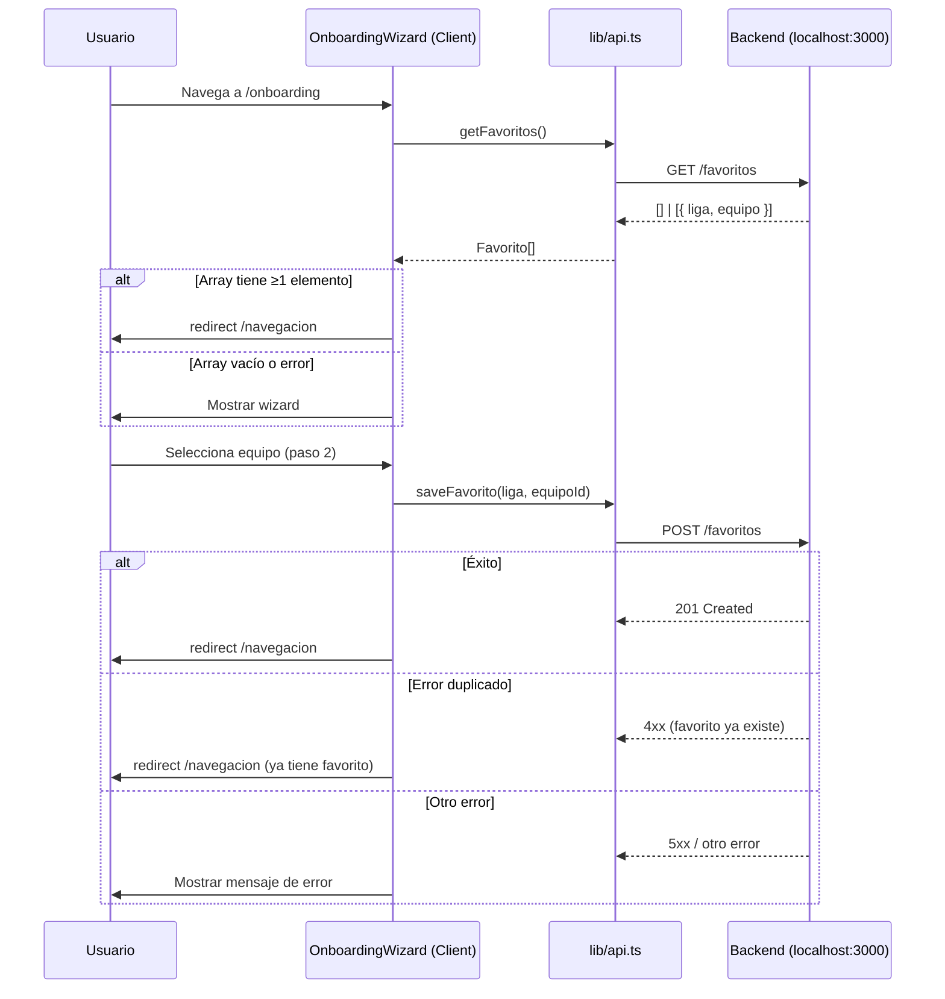

# Design Document: favoritos-usuario

## Overview

Esta feature añade la lógica de verificación de favorito existente al flujo de onboarding. Cuando un usuario autenticado navega a `/onboarding`, el sistema consulta `GET /favoritos` antes de mostrar el wizard. Si ya existe al menos un favorito, redirige directamente a `/navegacion`. Si no existe o la consulta falla, muestra el wizard normalmente. Además, se añade `getFavoritos()` en `lib/api.ts` como función centralizada para esa consulta, y se mejora el manejo del error de duplicado en `saveFavorito`.

El objetivo es evitar que un usuario que ya completó el onboarding vea el wizard de nuevo, y manejar de forma robusta los casos de error sin bloquear el flujo.

## Architecture

El flujo sigue el patrón existente del proyecto: Client Component en Next.js App Router que llama a funciones de `lib/api.ts`, las cuales hacen fetch al backend REST en `NEXT_PUBLIC_API_URL`.



## Components and Interfaces

### `lib/api.ts` — `getFavoritos()`

Nueva función que encapsula `GET /favoritos`:

```typescript
export async function getFavoritos(): Promise<Favorito[]>
```

- Hace `fetch` a `${BACKEND_URL}/favoritos` con `cache: 'no-store'`
- Si la respuesta es exitosa, retorna el array de favoritos
- Si la respuesta no es exitosa, lanza un `Error` con mensaje descriptivo

### `app/onboarding/page.tsx` — `OnboardingWizard`

Modificaciones al componente existente:

**Estado nuevo:**
- `checkingFavorito: boolean` — `true` mientras se verifica si ya existe favorito (estado inicial `true`)

**Lógica nueva en `useEffect` de montaje:**
```
1. Llamar getFavoritos()
2. Si array.length >= 1 → router.push('/navegacion')
3. Si array vacío → setCheckingFavorito(false) (mostrar wizard)
4. Si error → setCheckingFavorito(false) (mostrar wizard, no bloquear)
```

**Modificación en `handleSelectEquipo`:**
- Mantiene el comportamiento actual de guardar en localStorage
- Llama a `saveFavorito()`
- Si falla con error de duplicado → `router.push('/navegacion')`
- Si falla con otro error → mostrar mensaje de error al usuario
- Si tiene éxito → `router.push('/navegacion')`

**Render:**
- Mientras `checkingFavorito === true` → mostrar `<Spinner />` centrado (pantalla completa)
- Cuando `checkingFavorito === false` → mostrar wizard normalmente

### Detección de error duplicado

El backend retorna un error HTTP (4xx) cuando se intenta guardar un favorito que ya existe. La función `saveFavorito` en `lib/api.ts` actualmente lanza `Error('Error al guardar favorito')` para cualquier respuesta no exitosa. Para distinguir el error de duplicado, se necesita inspeccionar el status code o el body de la respuesta.

Estrategia: modificar `saveFavorito` para que en caso de error no-ok, lance un error que incluya el status HTTP, permitiendo al componente distinguir el caso de duplicado (HTTP 409 Conflict o similar).

Alternativamente, si el backend retorna cualquier 4xx para duplicado, el componente puede tratar todos los errores 4xx como "ya existe" y redirigir, reservando el mensaje de error solo para errores 5xx. Sin embargo, la opción más robusta es propagar el status code.

**Decisión de diseño:** `saveFavorito` lanzará un error tipado `ApiError` con `status` y `message`, permitiendo al componente distinguir el tipo de fallo.

## Data Models

### `Favorito`

Tipo nuevo en `types/api.types.ts` (o inline en `lib/api.ts`):

```typescript
export interface Favorito {
  liga: string;
  equipo: string;
}
```

El backend retorna un array de estos objetos en `GET /favoritos`.

### `ApiError`

Clase de error personalizada para propagar el status HTTP:

```typescript
export class ApiError extends Error {
  constructor(
    public readonly status: number,
    message: string
  ) {
    super(message);
    this.name = 'ApiError';
  }
}
```

`saveFavorito` lanzará `ApiError` en lugar de `Error` genérico cuando la respuesta no sea exitosa, permitiendo al componente verificar `error instanceof ApiError && error.status === 409` (o el código que use el backend para duplicado).


## Correctness Properties

*A property is a characteristic or behavior that should hold true across all valid executions of a system — essentially, a formal statement about what the system should do. Properties serve as the bridge between human-readable specifications and machine-verifiable correctness guarantees.*

### Property 1: Verificación de favorito al montar

*For any* usuario autenticado que navega a `/onboarding`, el componente `OnboardingWizard` debe llamar a `getFavoritos()` durante el montaje, antes de renderizar el contenido del wizard.

**Validates: Requirements 1.1**

### Property 2: Spinner durante verificación inicial

*For any* estado del componente donde `checkingFavorito === true`, el componente debe renderizar el indicador de carga (`Spinner`) y no el contenido del wizard (paso 1 o paso 2).

**Validates: Requirements 1.2**

### Property 3: Array no vacío implica redirección

*For any* respuesta de `getFavoritos()` que contenga al menos un elemento, el componente debe llamar a `router.push('/navegacion')` y no mostrar el wizard.

**Validates: Requirements 1.3**

### Property 4: Error en getFavoritos no bloquea el wizard

*For any* error lanzado por `getFavoritos()` (error de red, error HTTP, timeout), el componente debe mostrar el wizard normalmente sin bloquear al usuario.

**Validates: Requirements 1.5**

### Property 5: saveFavorito recibe los parámetros correctos

*For any* equipo seleccionado en el paso 2 del wizard, la llamada a `saveFavorito` debe recibir exactamente `(equipo.liga, equipo._id)` como argumentos.

**Validates: Requirements 2.1**

### Property 6: Éxito en saveFavorito persiste en localStorage y redirige

*For any* equipo guardado exitosamente, el componente debe escribir `ligaFavorita` y `equipoFavorito` en `localStorage` con los valores correctos, y luego redirigir a `/navegacion`.

**Validates: Requirements 2.2**

### Property 7: Error no-duplicado en saveFavorito muestra mensaje de error

*For any* error lanzado por `saveFavorito` que no sea un error de favorito duplicado (status distinto de 409), el componente debe mostrar un mensaje de error al usuario y no redirigir.

**Validates: Requirements 2.4**

### Property 8: getFavoritos retorna array o lanza error según la respuesta HTTP

*For any* respuesta HTTP exitosa de `GET /favoritos`, `getFavoritos()` debe retornar el array de favoritos recibido. *For any* respuesta HTTP de error, `getFavoritos()` debe lanzar un error con mensaje descriptivo.

**Validates: Requirements 3.1, 3.2, 3.3**

## Error Handling

| Escenario | Comportamiento |
|---|---|
| `GET /favoritos` falla (red / HTTP error) | Mostrar wizard normalmente; no bloquear al usuario |
| `GET /favoritos` retorna array vacío | Mostrar wizard normalmente |
| `GET /favoritos` retorna array con ≥1 elemento | Redirigir a `/navegacion` |
| `POST /favoritos` tiene éxito | Guardar en localStorage + redirigir a `/navegacion` |
| `POST /favoritos` falla con error de duplicado (409) | Redirigir a `/navegacion` (el favorito ya existe) |
| `POST /favoritos` falla con otro error | Mostrar mensaje de error; permitir reintentar |

La función `saveFavorito` en `lib/api.ts` debe lanzar `ApiError` (con `status` HTTP) en lugar de `Error` genérico, para que el componente pueda distinguir el error de duplicado del resto.

La función `getFavoritos` lanza `Error` genérico en caso de respuesta no exitosa; el componente captura cualquier error y muestra el wizard.

## Testing Strategy

### Unit Tests

Enfocados en casos concretos y condiciones de error:

- `getFavoritos()` retorna el array cuando el fetch es exitoso
- `getFavoritos()` lanza error cuando el fetch retorna status no-ok
- `saveFavorito()` lanza `ApiError` con el status correcto cuando el fetch falla
- `OnboardingWizard` muestra `Spinner` en el estado inicial de verificación
- `OnboardingWizard` muestra el wizard cuando `getFavoritos()` retorna array vacío
- `OnboardingWizard` redirige a `/navegacion` cuando `getFavoritos()` retorna array vacío (ejemplo concreto con 1 favorito)
- `OnboardingWizard` redirige a `/navegacion` cuando `saveFavorito()` lanza `ApiError` con status 409

### Property-Based Tests

Usando una librería de PBT (recomendado: **fast-check** para TypeScript/Jest).

Cada test debe ejecutarse con mínimo **100 iteraciones**.

**Property 1 — Verificación al montar**
```
// Feature: favoritos-usuario, Property 1: Verificación de favorito al montar
// Para cualquier array de favoritos (incluyendo vacío), al montar OnboardingWizard
// siempre se llama a getFavoritos exactamente una vez.
```

**Property 2 — Spinner durante verificación**
```
// Feature: favoritos-usuario, Property 2: Spinner durante verificación inicial
// Para cualquier estado donde checkingFavorito=true, el render no contiene
// el contenido del wizard.
```

**Property 3 — Array no vacío implica redirección**
```
// Feature: favoritos-usuario, Property 3: Array no vacío implica redirección
// Para cualquier array de favoritos con length >= 1, OnboardingWizard
// llama a router.push('/navegacion') y no renderiza el wizard.
```

**Property 4 — Error en getFavoritos no bloquea**
```
// Feature: favoritos-usuario, Property 4: Error en getFavoritos no bloquea el wizard
// Para cualquier error lanzado por getFavoritos, el wizard se muestra normalmente.
```

**Property 5 — Parámetros correctos en saveFavorito**
```
// Feature: favoritos-usuario, Property 5: saveFavorito recibe los parámetros correctos
// Para cualquier Equipo generado aleatoriamente, handleSelectEquipo llama a
// saveFavorito(equipo.liga, equipo._id).
```

**Property 6 — Éxito persiste y redirige**
```
// Feature: favoritos-usuario, Property 6: Éxito en saveFavorito persiste en localStorage y redirige
// Para cualquier Equipo, tras éxito de saveFavorito, localStorage contiene
// ligaFavorita=equipo.liga y equipoFavorito=equipo._id, y se redirige a /navegacion.
```

**Property 7 — Error no-duplicado muestra mensaje**
```
// Feature: favoritos-usuario, Property 7: Error no-duplicado en saveFavorito muestra mensaje de error
// Para cualquier ApiError con status != 409, el componente muestra un mensaje
// de error y no llama a router.push.
```

**Property 8 — getFavoritos round-trip**
```
// Feature: favoritos-usuario, Property 8: getFavoritos retorna array o lanza error según respuesta HTTP
// Para cualquier array de Favorito[], si el fetch mock retorna ese array con status 200,
// getFavoritos() retorna exactamente ese array.
// Para cualquier status HTTP de error (400-599), getFavoritos() lanza un Error.
```
