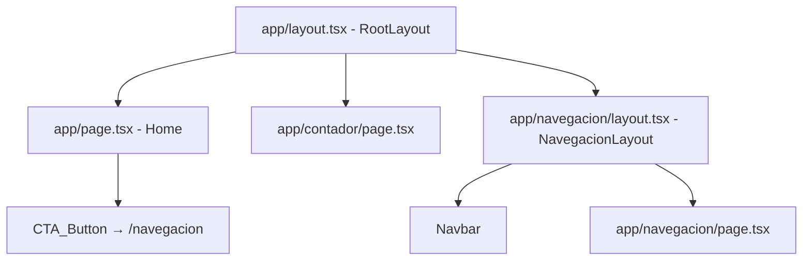

# Design Document: navbar-navigation

## Overview

Se añaden dos piezas mínimas a la aplicación Next.js existente:

1. Un botón CTA al final de `app/page.tsx` que redirige a `/navegacion`.
2. Una nueva ruta `/navegacion` con su propio layout que incluye un `Navbar` con enlaces activos a `/` y `/contador`.

El Navbar **no** se coloca en el root layout, por lo que las rutas existentes (`/` y `/contador`) no se ven afectadas.

---

## Architecture



- `app/navegacion/layout.tsx` es un **nested layout** de Next.js App Router. Envuelve únicamente las rutas bajo `/navegacion`.
- `Navbar` usa `usePathname()` (Client Component) para detectar la ruta activa.
- `app/page.tsx` recibe solo un elemento adicional al final: el `CTA_Button`.

---

## Components and Interfaces

### Navbar

```tsx
// components/ui/Navbar.tsx
'use client';

interface NavLink {
  href: string;
  label: string;
}

const links: NavLink[] = [
  { href: '/', label: 'Inicio' },
  { href: '/contador', label: 'Partidos' },
];
```

- Usa `usePathname()` de `next/navigation` para comparar la ruta activa.
- Renderiza `<Link>` de Next.js para cada entrada.
- Aplica clase activa cuando `pathname === href`.

### CTAButton

```tsx
// components/ui/CTAButton.tsx
import Link from 'next/link';

interface CTAButtonProps {
  href: string;
  label: string;
}
```

- Componente de presentación puro (Server Component).
- Estilo coherente con el tema oscuro slate/emerald existente.

### NavegacionLayout

```tsx
// app/navegacion/layout.tsx
import Navbar from '@/components/ui/Navbar';

export default function NavegacionLayout({ children }) {
  return (
    <div>
      <Navbar />
      {children}
    </div>
  );
}
```

- Nested layout exclusivo de `/navegacion`.
- No modifica `app/layout.tsx`.

---

## Data Models

No se introducen nuevos modelos de datos. Los únicos datos relevantes son:

| Concepto | Tipo | Descripción |
|---|---|---|
| `NavLink` | `{ href: string; label: string }` | Entrada de navegación en el Navbar |
| `pathname` | `string` | Ruta activa obtenida de `usePathname()` |

---

## Correctness Properties

*A property is a characteristic or behavior that should hold true across all valid executions of a system — essentially, a formal statement about what the system should do. Properties serve as the bridge between human-readable specifications and machine-verifiable correctness guarantees.*

### Property 1: Navbar siempre contiene los enlaces requeridos

*For any* render del componente `Navbar`, independientemente de la ruta activa, el output debe contener exactamente un enlace con `href="/"` y un enlace con `href="/contador"`.

**Validates: Requirements 2.3**

### Property 2: Enlace activo recibe estilo diferenciado

*For any* pathname válido, cuando el `Navbar` se renderiza con ese pathname como ruta activa, el enlace cuyo `href` coincide con el pathname debe tener aplicada la clase/estilo activo, y los demás enlaces no deben tenerla.

**Validates: Requirements 2.5**

---

## Error Handling

| Escenario | Comportamiento esperado |
|---|---|
| `usePathname()` retorna `null` (SSR edge case) | Ningún enlace se marca como activo; el Navbar se renderiza sin errores |
| La ruta `/navegacion` no tiene contenido propio | Se muestra el Navbar y un contenido vacío o placeholder; no hay crash |

---

## Testing Strategy

### Dual approach

**Unit / Example tests** (Jest + React Testing Library):

- Verificar que `app/page.tsx` renderiza el `CTAButton` con `href="/navegacion"`.
- Verificar que `app/layout.tsx` no importa ni renderiza `Navbar`.
- Verificar que `app/navegacion/layout.tsx` renderiza el `Navbar`.
- Verificar que la ruta `/navegacion` está disponible (page component existe y exporta default).

**Property-based tests** (fast-check + React Testing Library):

Librería elegida: **fast-check** (compatible con Jest/Vitest, amplio soporte TypeScript).

Cada test de propiedad debe ejecutarse con mínimo **100 iteraciones**.

#### Property Test 1 — Navbar siempre contiene los enlaces requeridos

```
// Feature: navbar-navigation, Property 1: Navbar siempre contiene los enlaces requeridos
fc.assert(
  fc.property(fc.constantFrom('/', '/contador', '/navegacion', '/otro'), (pathname) => {
    render(<Navbar />, { /* mock usePathname → pathname */ });
    expect(screen.getByRole('link', { name: 'Inicio' })).toHaveAttribute('href', '/');
    expect(screen.getByRole('link', { name: 'Partidos' })).toHaveAttribute('href', '/contador');
  }),
  { numRuns: 100 }
);
```

**Validates: Property 1 → Requirements 2.3**

#### Property Test 2 — Enlace activo recibe estilo diferenciado

```
// Feature: navbar-navigation, Property 2: Enlace activo recibe estilo diferenciado
fc.assert(
  fc.property(fc.constantFrom('/', '/contador'), (activePath) => {
    render(<Navbar />, { /* mock usePathname → activePath */ });
    const activeLink = screen.getByRole('link', { name: activePath === '/' ? 'Inicio' : 'Partidos' });
    const inactiveLink = screen.getByRole('link', { name: activePath === '/' ? 'Partidos' : 'Inicio' });
    expect(activeLink.className).toMatch(/active|font-bold|text-emerald/);
    expect(inactiveLink.className).not.toMatch(activeLink.className);
  }),
  { numRuns: 100 }
);
```

**Validates: Property 2 → Requirements 2.5**

### Balance

- Los tests de ejemplo cubren integración (layout, routing, no-regresión del root layout).
- Los tests de propiedad cubren el comportamiento universal del Navbar ante cualquier ruta.
- No se duplican: los ejemplos verifican casos concretos, las propiedades verifican invariantes generales.
