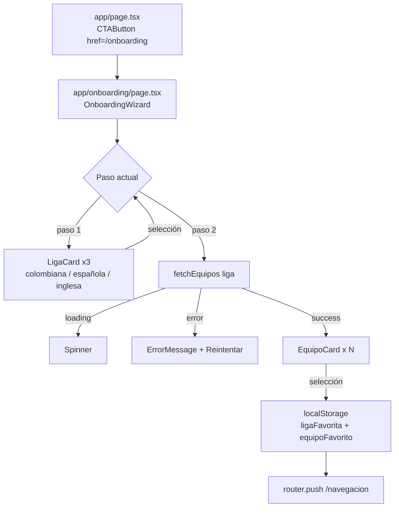

# Design Document — onboarding-liga-equipo

## Overview

Flujo de onboarding de 2 pasos que se inserta entre la landing page (`/`) y la vista principal (`/navegacion`). El usuario selecciona primero su liga favorita y luego su equipo favorito. La selección se persiste en `localStorage` y se usa para personalizar la experiencia posterior.

El flujo es lineal: `/` → `/onboarding` (paso 1: liga → paso 2: equipo) → `/navegacion`.

## Architecture

El wizard vive en `app/onboarding/page.tsx` como Client Component (`"use client"`), ya que gestiona estado local (paso actual, liga seleccionada, equipos cargados) e interacciones del usuario.



La lógica de fetch en el paso 2 se maneja con `useEffect` + estado local (`loading`, `error`, `equipos`). No se introduce ninguna librería de data-fetching adicional.

## Components and Interfaces

### `app/onboarding/page.tsx` — `OnboardingWizard`

Client Component. Gestiona el estado del wizard.

```typescript
type Paso = 1 | 2;

interface WizardState {
  paso: Paso;
  ligaSeleccionada: Liga | null;
  equipos: Equipo[];
  loading: boolean;
  error: string | null;
}
```

Responsabilidades:
- Renderizar el indicador de progreso (paso X de 2)
- En paso 1: mostrar las tres `LigaCard`
- En paso 2: llamar `fetchEquipos(liga)`, manejar loading/error, mostrar `EquipoCard` por cada equipo
- Al seleccionar equipo: guardar en `localStorage` y redirigir con `useRouter`

### `components/onboarding/LigaCard.tsx`

```typescript
interface LigaCardProps {
  liga: Liga;                    // "colombiana" | "española" | "inglesa"
  seleccionada: boolean;
  onSelect: (liga: Liga) => void;
}
```

Tarjeta seleccionable con nombre de liga, emoji/icono representativo y estado visual de selección (borde emerald + fondo destacado cuando `seleccionada === true`).

### `components/onboarding/EquipoCard.tsx`

```typescript
interface EquipoCardProps {
  equipo: Equipo;                // { _id, nombre, escudo, fechaCreacion, liga }
  onSelect: (equipo: Equipo) => void;
}
```

Tarjeta con imagen del escudo (`next/image`) y nombre del equipo. Incluye fallback visible (placeholder con inicial del nombre) si la imagen no carga.

### Modificación: `app/page.tsx`

Cambio mínimo: `href="/navegacion"` → `href="/onboarding"` en el `CTAButton`.

## Data Models

No se introducen nuevos tipos. Se reutilizan los existentes:

```typescript
// types/equipo.types.ts (sin cambios)
type Liga = "colombiana" | "española" | "inglesa";

interface Equipo {
  _id: string;
  nombre: string;
  escudo: string;      // URL de imagen
  fechaCreacion: string;
  liga: Liga;
}
```

**localStorage schema:**

| Clave | Tipo | Ejemplo |
|---|---|---|
| `ligaFavorita` | `Liga` | `"colombiana"` |
| `equipoFavorito` | `string` (_id) | `"64a1b2c3d4e5f6a7b8c9d0e1"` |

## Correctness Properties

*A property is a characteristic or behavior that should hold true across all valid executions of a system — essentially, a formal statement about what the system should do. Properties serve as the bridge between human-readable specifications and machine-verifiable correctness guarantees.*

### Property 1: Selección de liga avanza al paso 2

*For any* liga del conjunto `{colombiana, española, inglesa}`, cuando el usuario la selecciona en el paso 1, el wizard debe transicionar al paso 2 y la liga seleccionada debe quedar registrada en el estado.

**Validates: Requirements 2.3**

### Property 2: fetchEquipos recibe la liga correcta

*For any* liga seleccionada en el paso 1, al avanzar al paso 2 el wizard debe invocar `fetchEquipos` exactamente con esa liga como argumento.

**Validates: Requirements 3.1**

### Property 3: EquipoCards corresponden a los equipos recibidos

*For any* array de equipos devuelto por la API, el wizard debe renderizar exactamente una `EquipoCard` por cada equipo, y cada card debe mostrar el `nombre` y el `escudo` del equipo correspondiente.

**Validates: Requirements 3.3**

### Property 4: Volver atrás preserva la liga seleccionada

*For any* liga seleccionada en el paso 1, al pulsar "Atrás" desde el paso 2, el wizard debe regresar al paso 1 con esa misma liga aún marcada como seleccionada.

**Validates: Requirements 3.6**

### Property 5: Selección de equipo persiste correctamente en localStorage

*For any* equipo seleccionado en el paso 2, `localStorage.getItem("ligaFavorita")` debe devolver la liga de ese equipo y `localStorage.getItem("equipoFavorito")` debe devolver el `_id` de ese equipo.

**Validates: Requirements 4.1**

## Error Handling

| Escenario | Comportamiento |
|---|---|
| `fetchEquipos` falla (red, 5xx, etc.) | Mostrar `ErrorMessage` con texto descriptivo + botón "Reintentar" que vuelve a llamar `fetchEquipos` |
| Imagen de escudo no carga (`onError` en `next/image`) | Mostrar fallback: div con inicial del nombre del equipo sobre fondo slate |
| `localStorage` no disponible (SSR / modo privado estricto) | Capturar excepción con try/catch; continuar la redirección igualmente |

El componente es Client Component, por lo que el fetch ocurre en el cliente y los errores de red se capturan en el `useEffect`.

## Testing Strategy

### Unit Tests

Enfocados en ejemplos concretos y casos de borde:

- Renderizado inicial del paso 1: título correcto, tres `LigaCard`, indicador "1 de 2"
- `CTAButton` en `app/page.tsx` apunta a `/onboarding`
- Estado de carga (spinner visible mientras `fetchEquipos` no resuelve)
- Estado de error: mensaje descriptivo + botón "Reintentar" visibles
- Indicador de progreso en paso 2 muestra "2 de 2"
- Redirección a `/navegacion` tras seleccionar equipo
- Fondo con clases `from-slate-950 via-slate-900 to-emerald-950`
- `EquipoCard` muestra fallback cuando la imagen falla

### Property-Based Tests

Librería: **fast-check** (compatible con Jest/Vitest, amplio soporte TypeScript).

Configuración mínima: **100 iteraciones** por propiedad.

Cada test debe incluir un comentario de trazabilidad:
`// Feature: onboarding-liga-equipo, Property N: <texto>`

**Property 1 — Selección de liga avanza al paso 2**
```
// Feature: onboarding-liga-equipo, Property 1: selección de liga avanza al paso 2
fc.assert(fc.property(
  fc.constantFrom("colombiana", "española", "inglesa"),
  (liga) => {
    // render wizard en paso 1, simular click en LigaCard(liga)
    // assert: paso === 2 && ligaSeleccionada === liga
  }
), { numRuns: 100 });
```

**Property 2 — fetchEquipos recibe la liga correcta**
```
// Feature: onboarding-liga-equipo, Property 2: fetchEquipos recibe la liga correcta
fc.assert(fc.property(
  fc.constantFrom("colombiana", "española", "inglesa"),
  (liga) => {
    // simular selección de liga, avanzar a paso 2
    // assert: fetchEquipos fue llamado con liga como argumento
  }
), { numRuns: 100 });
```

**Property 3 — EquipoCards corresponden a los equipos recibidos**
```
// Feature: onboarding-liga-equipo, Property 3: EquipoCards corresponden a los equipos recibidos
fc.assert(fc.property(
  fc.array(equipoArbitrary, { minLength: 0, maxLength: 20 }),
  (equipos) => {
    // mockear fetchEquipos para devolver equipos
    // assert: número de EquipoCards === equipos.length
    // assert: cada card muestra nombre y escudo del equipo correspondiente
  }
), { numRuns: 100 });
```

**Property 4 — Volver atrás preserva la liga seleccionada**
```
// Feature: onboarding-liga-equipo, Property 4: volver atrás preserva la liga seleccionada
fc.assert(fc.property(
  fc.constantFrom("colombiana", "española", "inglesa"),
  (liga) => {
    // seleccionar liga → avanzar a paso 2 → pulsar Atrás
    // assert: paso === 1 && ligaSeleccionada === liga
  }
), { numRuns: 100 });
```

**Property 5 — Selección de equipo persiste en localStorage**
```
// Feature: onboarding-liga-equipo, Property 5: selección de equipo persiste en localStorage
fc.assert(fc.property(
  equipoArbitrary,
  (equipo) => {
    // simular selección de equipo en paso 2
    // assert: localStorage.getItem("ligaFavorita") === equipo.liga
    // assert: localStorage.getItem("equipoFavorito") === equipo._id
  }
), { numRuns: 100 });
```
