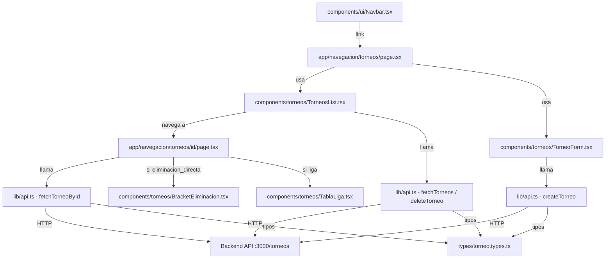

# Design Document

## Feature: torneos-navbar

---

## Overview

Este diseño describe la integración del módulo de torneos en la aplicación Next.js existente. La funcionalidad se compone de tres partes coordinadas:

1. Un nuevo enlace "Torneos" en la Navbar existente (`components/ui/Navbar.tsx`).
2. Una nueva página `/navegacion/torneos` con listado, creación y eliminación de torneos.
3. Funciones de API centralizadas en `lib/api.ts` y tipos en `types/torneo.types.ts`.

El patrón de implementación sigue exactamente el estilo ya establecido en el proyecto: Client Components con `useState`/`useEffect`, funciones de fetch en `lib/api.ts`, tipos en `types/`, y componentes UI reutilizables (`Spinner`, `ErrorMessage`).

---

## Architecture



El flujo de datos es unidireccional: la página `torneos/page.tsx` mantiene el estado de la lista de torneos y lo pasa a los componentes hijos. Las acciones de creación y eliminación actualizan el estado local sin recargar la página.

---

## Components and Interfaces

### Navbar (modificación)

Archivo: `components/ui/Navbar.tsx`

Se agrega `{ href: '/navegacion/torneos', label: 'Torneos' }` al array `links` existente. No se requiere ningún otro cambio; el mecanismo de estilo activo ya funciona con `usePathname()`.

### Página de Torneos

Archivo: `app/navegacion/torneos/page.tsx`

Client Component que gestiona el estado global de la lista de torneos. Responsabilidades:
- Cargar torneos al montar (`fetchTorneos`).
- Mostrar `Spinner` durante carga y `ErrorMessage` en error.
- Mostrar mensaje vacío si no hay torneos.
- Pasar handlers de creación y eliminación a los componentes hijos.

Props del estado interno:
```ts
torneos: Torneo[]
loading: boolean
error: string | null
```

### TorneosList

Archivo: `components/torneos/TorneosList.tsx`

Componente de presentación que recibe la lista de torneos y un handler de eliminación.

```ts
interface TorneosListProps {
  torneos: Torneo[];
  onDelete: (id: string) => Promise<void>;
  deletingId: string | null; // id del torneo siendo eliminado
}
```

Renderiza cada torneo con: nombre, tipo (badge), número de equipos, y botón de eliminar. El botón se deshabilita cuando `deletingId === torneo._id`.

### TorneosList (actualización)

Archivo: `components/torneos/TorneosList.tsx`

Se agrega un botón "Ver torneo" a cada item de la lista que navega a `/navegacion/torneos/${torneo._id}` usando `useRouter` de `next/navigation`.

### Página de Detalle del Torneo

Archivo: `app/navegacion/torneos/[id]/page.tsx`

Client Component que carga y muestra el detalle de un torneo específico.

```ts
// Estado interno
torneo: Torneo | null
loading: boolean
error: string | null
```

- `useEffect` que llama `fetchTorneoById(params.id)` al montar.
- Muestra `<Spinner>` durante carga y `<ErrorMessage>` en error.
- Muestra nombre del torneo + badge de tipo.
- Si `tipo === 'eliminacion_directa'`: renderiza `<BracketEliminacion equipos={torneo.equipos} />`.
- Si `tipo === 'liga'`: renderiza `<TablaLiga equipos={torneo.equipos} />`.

### BracketEliminacion

Archivo: `components/torneos/BracketEliminacion.tsx`

```ts
interface BracketEliminacionProps {
  equipos: EquipoTorneo[];
}
```

- Renderiza un bracket visual de eliminación directa usando solo CSS/Tailwind (sin librerías externas).
- Los equipos se ubican en los slots de primera ronda (izquierda del bracket).
- Cada slot muestra: escudo (`img`) + nombre del equipo.
- Los slots vacíos (si el número de equipos no es potencia de 2) muestran "BYE".
- Paleta oscura: fondo `slate-800`/`slate-900`, bordes `slate-600`, texto blanco, acentos `emerald`.
- El número de rondas se calcula como `Math.ceil(Math.log2(equipos.length))`.

### TablaLiga

Archivo: `components/torneos/TablaLiga.tsx`

```ts
interface TablaLigaProps {
  equipos: EquipoTorneo[];
}
```

- Renderiza una lista/tabla de equipos con escudo y nombre.
- Paleta oscura: fondo `slate-800`, bordes `slate-700`, texto blanco.

### TorneoForm

Archivo: `components/torneos/TorneoForm.tsx`

Formulario controlado para crear un torneo. Gestiona su propio estado interno de campos y equipos.

```ts
interface TorneoFormProps {
  onCreated: (torneo: Torneo) => void;
}

interface FormState {
  nombre: string;
  tipo: TipoTorneo;
  equipos: EquipoTorneo[];
  submitting: boolean;
  error: string | null;
}
```

Permite agregar/eliminar equipos dinámicamente. El botón de envío se deshabilita mientras `submitting === true`. Requiere al menos un equipo para habilitar el envío.

---

## Data Models

Archivo nuevo: `types/torneo.types.ts`

```ts
export type TipoTorneo = "eliminacion_directa" | "liga";

export interface EquipoTorneo {
  nombre: string;
  escudo: string; // URL de imagen
}

export interface Torneo {
  _id: string;
  nombre: string;
  tipo: TipoTorneo;
  equipos: EquipoTorneo[];
}

export interface CreateTorneoDto {
  nombre: string;
  tipo: TipoTorneo;
  equipos: EquipoTorneo[];
}
```

### Funciones API

Adiciones a `lib/api.ts`:

```ts
fetchTorneos(): Promise<Torneo[]>
fetchTorneoById(id: string): Promise<Torneo>
createTorneo(data: CreateTorneoDto): Promise<Torneo>
deleteTorneo(id: string): Promise<void>
```

Todas siguen el patrón existente: `fetch` + comprobación `response.ok` + `throw new Error(...)` en caso de fallo.

---

## Correctness Properties

*A property is a characteristic or behavior that should hold true across all valid executions of a system — essentially, a formal statement about what the system should do. Properties serve as the bridge between human-readable specifications and machine-verifiable correctness guarantees.*

### Property 1: Enlace activo en Navbar

*For any* pathname, el enlace de la Navbar cuyo `href` coincide exactamente con el pathname actual debe tener la clase de estilo activo, y los demás enlaces no deben tenerla.

**Validates: Requirements 1.2**

---

### Property 2: Renderizado completo de torneos

*For any* array de torneos retornado por la API, cada torneo debe aparecer en el DOM con su nombre, tipo y número de equipos participantes visibles.

**Validates: Requirements 3.1, 3.5**

---

### Property 3: Acción de eliminar presente por torneo

*For any* lista de torneos renderizada, cada torneo debe tener exactamente una acción de eliminar asociada.

**Validates: Requirements 5.1**

---

### Property 4: Creación llama a la API con los datos correctos

*For any* `CreateTorneoDto` válido enviado desde el formulario, la función `createTorneo` debe ser invocada con exactamente ese objeto como argumento.

**Validates: Requirements 4.6, 6.3**

---

### Property 5: Lista actualizada tras creación

*For any* torneo creado exitosamente, ese torneo debe aparecer en la lista de torneos renderizada sin recargar la página.

**Validates: Requirements 4.7**

---

### Property 6: Eliminación llama a la API con el id correcto

*For any* torneo en la lista, al confirmar su eliminación, `deleteTorneo` debe ser invocada con el `_id` de ese torneo.

**Validates: Requirements 5.2, 6.4**

---

### Property 7: Lista actualizada tras eliminación

*For any* torneo eliminado exitosamente, ese torneo no debe aparecer en la lista de torneos renderizada.

**Validates: Requirements 5.3**

---

### Property 8: API lanza error en respuesta no exitosa

*For any* función de la API de torneos (`fetchTorneos`, `createTorneo`, `deleteTorneo`) y cualquier respuesta HTTP con status no 2xx, la función debe lanzar un `Error` con un mensaje descriptivo.

**Validates: Requirements 6.5**

---

### Property 9: fetchTorneos retorna el array del backend

*For any* array de torneos que el backend retorne en `GET /torneos`, `fetchTorneos` debe retornar ese mismo array sin modificaciones.

**Validates: Requirements 6.2**

---

### Property 10: Equipos dinámicos en el formulario

*For any* número N de equipos agregados al formulario (N ≥ 1), el estado del formulario debe contener exactamente N equipos con los datos introducidos.

**Validates: Requirements 4.4**

---

## Error Handling

| Escenario | Comportamiento |
|---|---|
| `GET /torneos` falla | Mostrar `ErrorMessage` en la página, no renderizar lista |
| `POST /torneos` falla | Mostrar error dentro del formulario, mantener formulario abierto |
| `DELETE /torneos/:id` falla | Mostrar `ErrorMessage` en la página, mantener torneo en lista |
| Formulario enviado sin equipos | Botón de envío deshabilitado (validación en cliente) |
| Formulario enviado sin nombre | Validación HTML5 `required` en el input |

Los errores de API se propagan como `Error` con mensaje descriptivo desde `lib/api.ts`. Los componentes capturan el error en un bloque `try/catch` y actualizan su estado de error local.

---

## Testing Strategy

### Unit Tests (Jest + React Testing Library)

Enfocados en ejemplos concretos y estados específicos:

- Navbar renderiza el enlace "Torneos" con href correcto (Req 1.1)
- Vista muestra `Spinner` durante carga (Req 3.4)
- Vista muestra `ErrorMessage` cuando la API falla (Req 3.3)
- Vista muestra mensaje vacío cuando no hay torneos (Req 3.2)
- Formulario muestra error y permanece abierto si `POST` falla (Req 4.8)
- Botón de envío deshabilitado mientras `submitting` (Req 4.9)
- Botón de eliminar deshabilitado mientras `deletingId` coincide (Req 5.5)
- `lib/api.ts` exporta las cuatro funciones de torneos (Req 6.1)
- Formulario bloquea envío sin equipos (Req 4.5)
- Select de tipo contiene exactamente `eliminacion_directa` y `liga` (Req 4.3)

### Property-Based Tests (fast-check)

Librería: [`fast-check`](https://github.com/dubzzz/fast-check) — compatible con Jest/Vitest, ampliamente usada en proyectos TypeScript.

Configuración: mínimo 100 iteraciones por propiedad (`numRuns: 100`).

Cada test debe incluir un comentario con el tag:
`// Feature: torneos-navbar, Property N: <texto de la propiedad>`

**Tests de propiedad a implementar:**

- **Property 1** — Generar pathnames aleatorios, renderizar Navbar, verificar que solo el enlace con href igual al pathname tiene clase activa.
- **Property 2** — Generar arrays aleatorios de `Torneo`, renderizar `TorneosList`, verificar que nombre, tipo y `equipos.length` de cada torneo aparecen en el DOM.
- **Property 3** — Generar arrays aleatorios de `Torneo`, renderizar `TorneosList`, verificar que hay exactamente un botón de eliminar por torneo.
- **Property 4** — Generar `CreateTorneoDto` aleatorios, simular envío del formulario, verificar que `createTorneo` es llamada con esos datos exactos.
- **Property 5** — Generar un torneo aleatorio, simular creación exitosa, verificar que aparece en la lista renderizada.
- **Property 6** — Generar lista de torneos y elegir uno al azar, simular eliminación, verificar que `deleteTorneo` es llamada con su `_id`.
- **Property 7** — Generar lista de torneos y elegir uno al azar, simular eliminación exitosa, verificar que ese torneo no aparece en la lista.
- **Property 8** — Para cada función de API, generar status codes no-2xx (400–599), verificar que se lanza un `Error`.
- **Property 9** — Generar arrays de `Torneo`, mockear `fetch` para retornarlos, verificar que `fetchTorneos` retorna el mismo array.
- **Property 10** — Generar N equipos aleatorios (N entre 1 y 10), agregarlos al formulario, verificar que el estado contiene exactamente esos N equipos.
